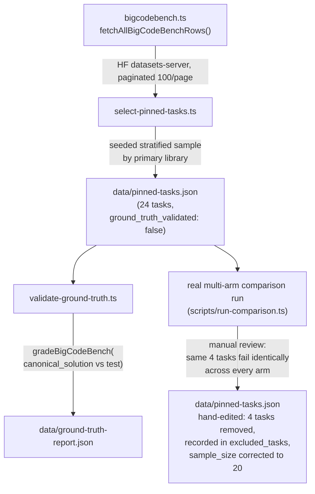
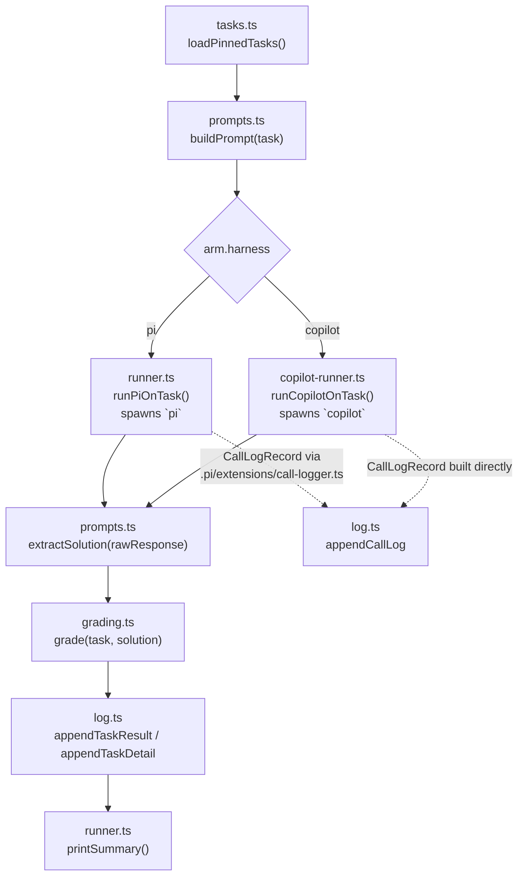
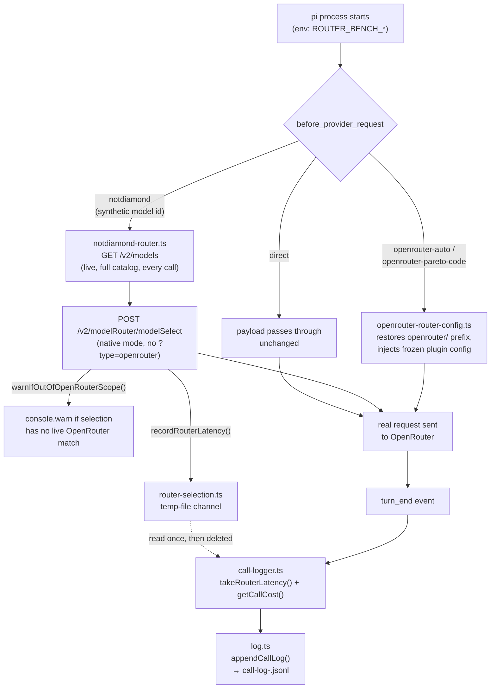
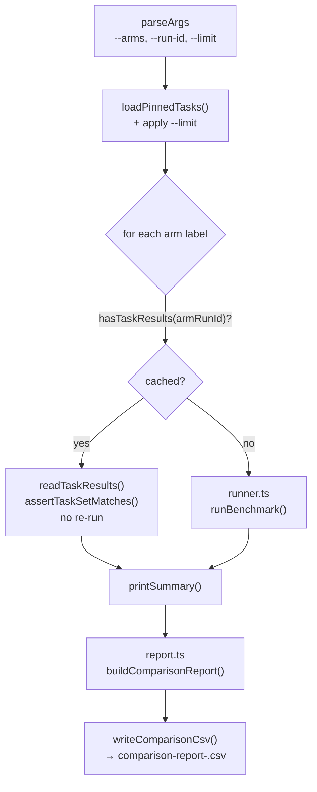

# Architecture flows

Four diagrams covering how this project actually moves data, each followed by a short numbered
walkthrough of what happens at each step (what it reads, what it writes, why).

## 1. Task curation (offline, one-off)

Run manually, before any benchmark run — not part of the measured runtime.

1. `bigcodebench.ts`'s `fetchAllBigCodeBenchRows` pulls every row of BigCodeBench-Instruct
   (`bigcode/bigcodebench`, split `v0.1.4`) via the Hugging Face datasets-server REST API,
   paginating since the server caps each page at 100 rows.
2. `select-pinned-tasks.ts` takes a seeded, stratified sample (24 tasks, capped per primary
   library so no single library dominates) and freezes it to `data/pinned-tasks.json`.
   `ground_truth_validated` is written `false` at this point.
3. `validate-ground-truth.ts` is the one place in this project that shells out to Python: it runs
   each task's own `canonical_solution` against its own `test` suite (via
   `bigcodebench-grader.ts`, the same executor real grading uses) and writes
   `data/ground-truth-report.json`. It does NOT flip `pinned-tasks.json`'s
   `ground_truth_validated` flag back to `true` — that's a manual judgment call once you've
   reviewed the report and decided whether to drop/replace any task that fails its own ground
   truth.
4. Passing your own ground truth isn't the only bar: a task can still have a prompt/test spec bug
   that no model could reasonably satisfy (e.g. the test expects Title-Case dict keys the prompt
   never mentions, or asserts on values only reproducible via an undisclosed reference
   implementation). That class of problem only surfaces once real models actually attempt the
   task, so it's caught by *reviewing a real comparison run*, not by ground-truth validation.
   4 of the original 24 tasks were excluded this way — all 3 arms in an early 24-task comparison
   run failed each of them identically, and inspection showed a genuine spec bug rather than a
   model shortcoming. This step has no dedicated script: the 4 tasks were removed from
   `pinned-tasks.json`'s `tasks` array by hand, each with its reasoning recorded under
   `excluded_tasks`, and `sample_size` corrected from 24 to 20 to match. **20, not 24, is the
   real, currently-used pinned set** — every arm/run in this project is measured against those
   20 tasks.

## 2. Single-arm benchmark run

`runner.ts`'s `runBenchmark` — the core loop, shared by `npm run bench` and
`scripts/run-comparison.ts`.

1. `loadPinnedTasks` reads `data/pinned-tasks.json` (falling back to 2 hardcoded stub tasks if it
   hasn't been generated yet), warning if `ground_truth_validated` is still `false`.
2. `buildPrompt` appends a per-source response-shape instruction to the task's own prompt —
   currently only for `bigcodebench`, since the grader needs just the function body, not a
   complete script.
3. Dispatch is by `arm.harness`: every arm except `copilot-auto` spawns `pi` (`runPiOnTask`,
   `--mode json`, no tools, no session); `copilot-auto` bypasses Pi entirely and spawns the
   `copilot` CLI directly (`runCopilotOnTask`), since Copilot is a self-contained agent with its
   own Auto model selection, not something Pi routes to.
4. `extractSolution` pulls the single fenced code block out of the raw response (falling back to
   trimmed raw text if nothing is fenced), preserving leading indentation — critical since the
   grader concatenates `code_prompt + solution` directly.
5. `grading.ts`'s `grade` dispatches to `bigcodebench-grader.ts` for `bigcodebench` tasks; any
   other source is `error_harness` (no grader implemented yet).
6. Every Pi call also produces a `CallLogRecord` — written by `.pi/extensions/call-logger.ts`'s
   `turn_end` handler (see flow 3 below) for the `pi` harness, or built directly inline for the
   `copilot` harness (no Pi extension mechanism available for a non-Pi process). `runBenchmark`
   reads these back (`readCallLog`) to roll up `calls`/`total_cost_usd`/`total_tool_calls` into
   the `TaskResult` it appends.
7. `printSummary` aggregates outcome counts, solve rate, total/avg/per-solved cost, and wall-clock
   time across the run.

## 3. Pi routing + call logging (the `pi` harness's inner mechanics)

What happens inside one spawned `pi` process, for the arms that route through OpenRouter or Not
Diamond — the two `.pi/extensions/*.ts` files and the log they write to.

1. `runner.ts` sets `ROUTER_BENCH_*` env vars once per spawned `pi` process so every extension
   knows which task/arm/model it's logging for, with no other coordination needed.
2. For `openrouter-auto`/`openrouter-pareto-code`, `openrouter-router-config.ts`'s
   `before_provider_request` hook restores the `"openrouter/"` namespace prefix Pi's own
   request-building strips (fatal for Pareto Code, undocumented behavior for Auto if left bare),
   and injects the frozen `min_coding_score`/cost-tier plugin config from env, if set.
3. For `notdiamond`, Pi is run with a synthetic model id (`__router_notdiamond__`);
   `notdiamond-router.ts` detects it, fetches Not Diamond's **entire live model catalog**
   (`GET /v2/models`, no env-configured list, no caching — a fresh fetch on every single call) and
   calls `modelSelect` in Not Diamond's **native mode** (no `?type=openrouter`), so it isn't
   limited to models that already have an OpenRouter mapping. Whichever model comes back gets
   written into the outgoing request; if that model has no live OpenRouter counterpart,
   `warnIfOutOfOpenRouterScope` logs a warning rather than failing silently, since the actual
   inference call below still always goes through OpenRouter. Not Diamond itself never proxies
   the inference call — it only returns the decision.
4. Only `notdiamond-router.ts` calls `recordRouterLatency` — it's the only arm with real routing
   latency to report. That latency crosses from the selector extension to `call-logger.ts`
   through a temp-file channel (`router-selection.ts`), not a plain module variable, because Pi
   isolates each extension's own module graph even though both resolve the same file path.
5. On `turn_end`, `call-logger.ts` reads back (and clears) that latency, resolves the real served
   model (`message.responseModel`, falling back to `message.model`), computes cost via
   `pricing.ts`'s `getCallCost` (a frozen OpenRouter pricing table takes priority for `openrouter`
   calls, since Pi's own reported cost is unreliable for router models), and appends one
   `CallLogRecord` per LLM turn to `call-log-<runId>.jsonl`.

## 4. Multi-arm comparison run

`scripts/run-comparison.ts` — runs several arms against the identical task subset and merges their
logs into one per-task CSV.

1. Each arm gets its own log-file run id, `<compareId>-<label>`, so every arm's `CallLogRecord`/
   `TaskResult`/`TaskDetail` rows land in their own files under one comparison run.
2. Before running anything, an arm whose results already exist on disk for that id is loaded from
   its existing JSONL files instead of re-run (`hasTaskResults`) — so adding one new arm to an
   existing comparison doesn't re-run (or re-bill) the arms already benchmarked.
3. `assertTaskSetMatches` guards that reuse: a cached arm's task-id set must exactly match what
   this invocation's `--limit` expects, or it throws rather than silently comparing mismatched
   subsets (most likely cause: a different `--limit` was used the first time).
4. Whichever arms actually need running go through the exact same `runBenchmark` as a standalone
   `npm run bench` call (flow 2 above) — no separate code path.
5. `report.ts`'s `buildComparisonReport` joins every arm's `TaskResult` and `CallLogRecord` by
   `task_id` into one wide row per task (`<label>_requested_model`, `_selected_model`, `_routed`,
   `_outcome`, `_cost_usd`, `_latency_ms` per arm), written out as
   `artifacts/comparison-report-<compareId>.csv`.
